  

<h1 align="center">Hi, I'm Wellington 👋</h1>

Software Engineering student building toward software architecture, with game development and writing as long-term creative interests.

🇺🇸 <b>English</b> | 🇧🇷 <a href="README.pt.md">Português</a>

---

## 🚀 About me

* 🏗️ Building toward **software architecture**. I like understanding how systems are structured, why they break, and how to design them to hold up over time
* 🎮 Grew up wanting to make games, and still write and build them as a hobby alongside my main path
* ✍️ Long-time hobby in **writing and literature**, which pairs naturally with how games use storytelling to communicate ideas
* 📍 Curitiba/PR, Brazil. Available for remote opportunities
* 🌎 Fluent in English and Portuguese

---

## 🧭 My path so far

**PUCPR - Software Engineering**
*2nd semester · Ongoing*

Deeper focus on programming logic and software engineering fundamentals, working with **Python, JavaScript, BPMN, UML, and Git/GitHub**, alongside HTML and CSS. On my own, I'm also exploring mobile development, currently building **Pausa** with Flutter and Dart.

**Universidade Positivo - Systems Analysis and Development**
*2 semesters*

Built a foundation in **C**, along with HTML, CSS, and SQL, with some self-taught exposure to **C#**.

*~2 years of hands-on development experience across coursework and personal projects.*

---

## 🛠️ Technologies and tools

**Languages:** C · Python · JavaScript · Dart · SQL  
**Web:** HTML · CSS  
**Mobile:** Flutter  
**Tools:** Git · GitHub  
**Modeling:** UML · BPMN

---

## 💡 Highlighted projects

### Pausa
A mobile app built with Flutter and Dart to log how you're feeling in the moment and what's influencing it, building a history over time for self-reflection. Started with a Figma prototype to define the UI/UX before development.

**Technologies:** Flutter, Dart
🔗 [GitHub repository](https://github.com/WellingtonNery/pausa)
🎨 [Figma prototype](https://www.figma.com/design/YUY5chQyRgP1jBIWEjVuNC/PAUSA?node-id=6-391&t=jn5TC6CPf6oaFKmh-1)

---

### 100 Days of Shogun
A 2D decision-based game built in Python with Pygame, inspired by games like *Reigns*. The player takes the role of a shogun, and every decision affects three interconnected system variables: Satisfaction, Population, and Money over 100 days.

**Technologies:** Python, Pygame
🔗 [GitHub repository](https://github.com/WellingtonNery/100daysShogun)

---

### Terapeuta Regina Olbre Prohmam
An academic team project developed as a real professional website for therapist Regina Olbre Prohmam. I contributed to the homepage, About, and Contact pages, focusing on their structure, layout, and responsive implementation.

**Technologies:** HTML, CSS, JavaScript
🔗 [GitHub repository](https://github.com/diegobochnia/Regina-Olbre-Prohmam)
🌐 [View website](https://diegobochnia.github.io/Regina-Olbre-Prohmam/)

---

### PUC-Imprest
An academic team project developed to unify the loan process for electronic devices at PUCPR. I contributed to the system's CRUD implementation, including the Technical Staff entity. The project is still under development.

**Technologies:** HTML, JavaScript, Tailwind CSS
🔗 [GitHub repository](https://github.com/WellingtonNery/Owners)
🌐 [View website](https://wellingtonnery.github.io/Owners)

---

## 📎 Other academic projects

Smaller coursework projects, kept for reference:

- **Pizzaria da Nonna** (HTML, CSS, JavaScript) - 🔗 [repo](https://github.com/WellingtonNery/Pizzaria-da-Nonna) 🌐 [site](https://wellingtonnery.github.io/Pizzaria-da-Nonna/)
- **Curitiba Parks Website** (HTML, CSS) - 🔗 [repo](https://github.com/diegobochnia/ParquesDeCuritiba-BES-PUCPR-2026) 🌐 [site](https://diegobochnia.github.io/ParquesDeCuritiba-BES-PUCPR-2026/)

---

## 📬 Contact

📧 Email: [welli.nery12@gmail.com](mailto:welli.nery12@gmail.com)
💼 LinkedIn: [My LinkedIn profile](https://www.linkedin.com/in/wellington-nery-costa/)
🐙 GitHub: [My GitHub profile](https://github.com/WellingtonNery)
