  

<h1 align="center">Olá, eu sou o Wellington 👋</h1>

Estudante de Engenharia de Software construindo meu caminho em direção à arquitetura de software, com desenvolvimento de jogos e escrita como interesses criativos de longa data.

🇺🇸 <a href="README.md">English</a> | 🇧🇷 <b>Português</b>

---

## 🚀 Sobre mim

* 🏗️ Construindo meu caminho em direção à **arquitetura de software**. Gosto de entender como os sistemas são estruturados, por que eles quebram e como projetá-los para que se sustentem ao longo do tempo
* 🎮 Cresci querendo criar jogos e ainda escrevo e desenvolvo jogos como hobby, paralelamente ao meu caminho principal
* ✍️ Tenho um interesse de longa data em **escrita e literatura**, que combina naturalmente com a forma como os jogos usam narrativas para transmitir ideias
* 📍 Curitiba/PR, Brasil. Disponível para oportunidades remotas
* 🌎 Fluente em inglês e português

---

## 🧭 Meu caminho até aqui

**PUCPR - Engenharia de Software**
*2º período · Em andamento*

Maior foco em lógica de programação e fundamentos de engenharia de software, trabalhando com **Python, JavaScript, BPMN, UML e Git/GitHub**, além de HTML e CSS. Por conta própria, também estou explorando desenvolvimento mobile e atualmente desenvolvendo o **Pausa** com Flutter e Dart.

**Universidade Positivo - Análise e Desenvolvimento de Sistemas**
*2 semestres*

Construí uma base em **C**, além de HTML, CSS e SQL, com alguma experiência autodidata em **C#**.

*~2 anos de desenvolvimento prático por meio de projetos acadêmicos e pessoais.*

---

## 🛠️ Tecnologias e ferramentas

**Linguagens:** C · Python · JavaScript · Dart · SQL  
**Web:** HTML · CSS  
**Mobile:** Flutter  
**Ferramentas:** Git · GitHub  
**Modelagem:** UML · BPMN  

---

## 💡 Projetos em destaque

### Pausa

Um aplicativo mobile desenvolvido com Flutter e Dart para registrar como você está se sentindo no momento e o que está influenciando isso, criando um histórico ao longo do tempo para reflexão pessoal. O projeto começou com um protótipo no Figma para definir a UI/UX antes do desenvolvimento.

**Tecnologias:** Flutter, Dart
🔗 [Repositório no GitHub](https://github.com/WellingtonNery/pausa)
🎨 [Protótipo no Figma](https://www.figma.com/design/YUY5chQyRgP1jBIWEjVuNC/PAUSA?node-id=6-391&t=jn5TC6CPf6oaFKmh-1)

---

### 100 Days of Shogun

Um jogo 2D baseado em decisões, desenvolvido em Python com Pygame e inspirado em jogos como *Reigns*. O jogador assume o papel de um xogum, e cada decisão afeta três variáveis interligadas do sistema: Satisfação, População e Dinheiro ao longo de 100 dias.

**Tecnologias:** Python, Pygame
🔗 [Repositório no GitHub](https://github.com/WellingtonNery/100daysShogun)

---

### Terapeuta Regina Olbre Prohmam

Um projeto acadêmico em equipe desenvolvido como um site profissional real para a terapeuta Regina Olbre Prohmam. Contribuí para as páginas inicial, Sobre e Contato, trabalhando em sua estrutura, layout e implementação responsiva.

**Tecnologias:** HTML, CSS, JavaScript
🔗 [Repositório no GitHub](https://github.com/diegobochnia/Regina-Olbre-Prohmam)
🌐 [Acessar site](https://diegobochnia.github.io/Regina-Olbre-Prohmam/)

---

### PUC-Imprest

Um projeto acadêmico em equipe desenvolvido para unificar o processo de empréstimo de dispositivos eletrônicos da PUCPR. Contribuí para a implementação do CRUD do sistema, incluindo a entidade Técnico. O projeto ainda está em desenvolvimento.

**Tecnologias:** HTML, JavaScript, Tailwind CSS
🔗 [Repositório no GitHub](https://github.com/WellingtonNery/Owners)
🌐 [Acessar site](https://wellingtonnery.github.io/Owners)

---

## 📎 Outros projetos acadêmicos

Projetos menores desenvolvidos durante as disciplinas, mantidos como referência:

* **Pizzaria da Nonna** (HTML, CSS, JavaScript) - 🔗 [repositório](https://github.com/WellingtonNery/Pizzaria-da-Nonna) 🌐 [site](https://wellingtonnery.github.io/Pizzaria-da-Nonna/)
* **Site dos Parques de Curitiba** (HTML, CSS) - 🔗 [repositório](https://github.com/diegobochnia/ParquesDeCuritiba-BES-PUCPR-2026) 🌐 [site](https://diegobochnia.github.io/ParquesDeCuritiba-BES-PUCPR-2026/)

---

## 📬 Contato

📧 E-mail: [welli.nery12@gmail.com](mailto:welli.nery12@gmail.com)
💼 LinkedIn: [Meu perfil no LinkedIn](https://www.linkedin.com/in/wellington-nery-costa/)
🐙 GitHub: [Meu perfil no GitHub](https://github.com/WellingtonNery)
